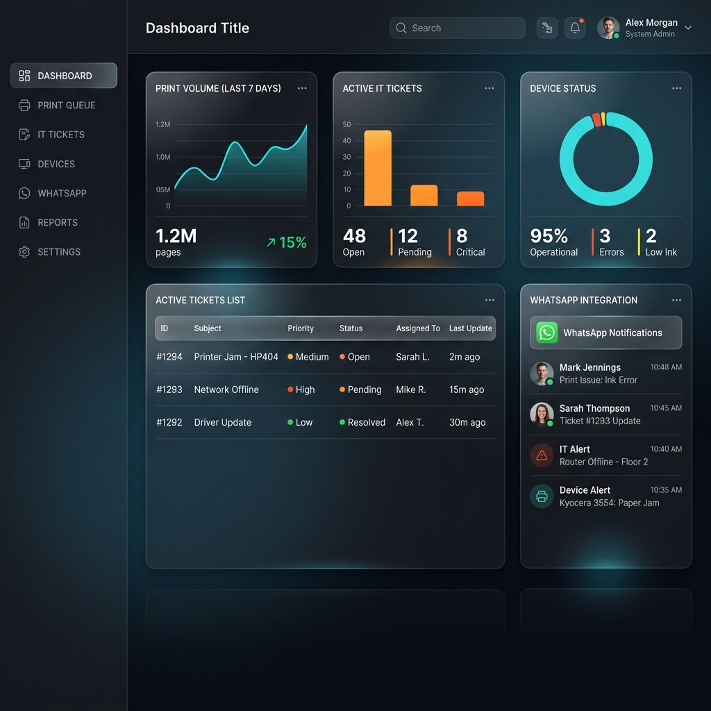

# Sistema de Impressão e Atendimento



Este repositório contém o sistema completo de impressão, chamados e integração com o WhatsApp (Evolution API).

## 🚀 Passo a Passo para uma Nova Instalação

A instalação do sistema foi projetada para ser simples, utilizando o Docker Compose para orquestrar todos os serviços necessários (Banco de Dados, Backend/API, Evolution API e Worker em segundo plano).

### Pré-requisitos
1. **Docker**: Instale o Docker e o Docker Compose na máquina que hospedará o servidor.
2. **Git**: Para clonar este repositório.

### Passo 1: Clonar o Repositório
Abra o terminal e clone este repositório no seu servidor local:
```bash
git clone https://github.com/kalbosque/Portal-de-Acesso.git
cd Portal-de-Acesso
```

### Passo 2: Configurar as Variáveis de Ambiente
O sistema requer algumas chaves de segurança e senhas para funcionar corretamente. 

1. Copie o arquivo de exemplo para criar o seu arquivo `.env`:
   ```bash
   cp .env.example .env
   ```
   *(No Windows via Prompt de Comando, use `copy .env.example .env`)*

2. Edite o arquivo `.env` preenchendos os seguintes campos obrigatórios com suas senhas seguras:
   - `POSTGRES_PASSWORD`: Defina a senha do usuário root do banco de dados.
   - `EVOLUTION_API_KEY`: Defina a chave de autenticação global (API Key) para o Evolution API.
   - `AGENT_API_KEY`: Defina a chave de autenticação da sua API/Agente.
   - `SMTP_PASS` (Opcional): Senha de envio de e-mails para notificações (usado pelo Background Worker).

### Passo 3: Inicialização dos Arquivos de Status
O Docker pode gerar erro ao tentar montar arquivos JSON que não existem ainda, criando diretórios no lugar. Para evitar isso, crie os arquivos de status vazios primeiro.

No Linux, macOS ou PowerShell, execute:
```bash
echo "{}" > status_maquinas.json
echo "{}" > status_usuarios.json
```

### Passo 4: Iniciar o Sistema (Docker Compose)
Para iniciar toda a infraestrutura de forma automática, execute o comando na raiz da pasta do projeto:
```bash
docker-compose up -d --build
```
Isso fará o download das imagens necessárias, criará o banco de dados (que executará o arquivo `init.sql` automaticamente no seu primeiro início) e colocará o Backend e a Evolution API no ar.

### Passo 5: Acessar a Plataforma
Após o build ser concluído, aguarde cerca de 20 a 30 segundos para o banco de dados e as APIs realizarem o boot completo e estabilizarem.

Acesse o sistema web nos seguintes endereços na sua rede local:
- **Backend/Sistema Principal**: `http://localhost:3001`
- **Evolution API (WhatsApp)**: `http://localhost:8081`

> *Nota: Você pode usar ferramentas como Nginx, Apache ou Cloudflare Tunnels (ngrok) para expor estas portas de forma segura na internet (proxy reverso com HTTPS) ou em um domínio próprio, caso o uso não seja apenas restrito na intranet local.*
